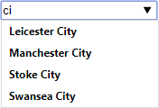

# Autocomplete

In this exercise, you will implement an autocompleting input field as a web component.

Several existing autocomplete components would serve your purpose quite well. However, it is
fairly easy to create your own as this exercise will show you. Creating your own autocomplete component
as a web component makes it even easier.

The figure shows an autocomplete web component that internally uses an `&lt;input&gt;` and a `&lt;datalist&gt;` element.

## Prerequisites

Install the required packages by writing `npm install` when you are in the folder `autocomplete`.

To have something to contact, to retrieve some data of a number of football teams, you need a simple local
server up and running. You find the code of the server in the folder `server`. Do not touch any of the code in the folder.

1. Open a new terminal window.
1. Start the server by writing `npm run server`.
1. The server will now be up and running listening on [http://localhost:3000](http://localhost:3000) (see server/app.js for details).

The server provides a very simple and RESTful API. Read the [documentation](server/README.md) and why not even test the API using Postman.

## The client

In the folder `./client/source/` you're free do what you need to do to implement an autocomplete web component.

Autocomplete is a well-known feature of many applications. Start typing in a search, and suggestions are offered
before you’ve even finished typing. In this exercise, the web component should offer suggestions of football teams.
You retrieve the suggestions from the server you started earlier.

Implemented correct your web component should suggest, when typing the word “ci”:

- Leicester City
- Manchester City
- Stoke City
- Swansea City

When you types anything that completely matches any of the suggestions a selection has been made.

For more details of the exercise, look at the recorded [demo](https://youtu.be/akFlBJh5J1U).

## Tips

- [&lt;input&gt;](https://developer.mozilla.org/en-US/docs/Web/HTML/Element/input)
- [&lt;datalist&gt;](https://developer.mozilla.org/en-US/docs/Web/HTML/Element/datalist)
- Use an attribute to define the API call to retrieve the suggestions.
- Let the web component trigger an event when a selection has changed.
